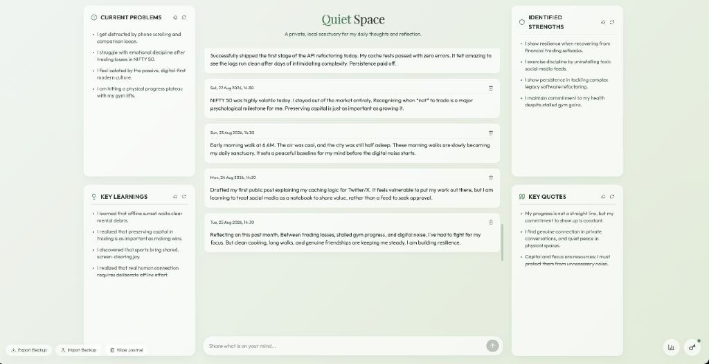
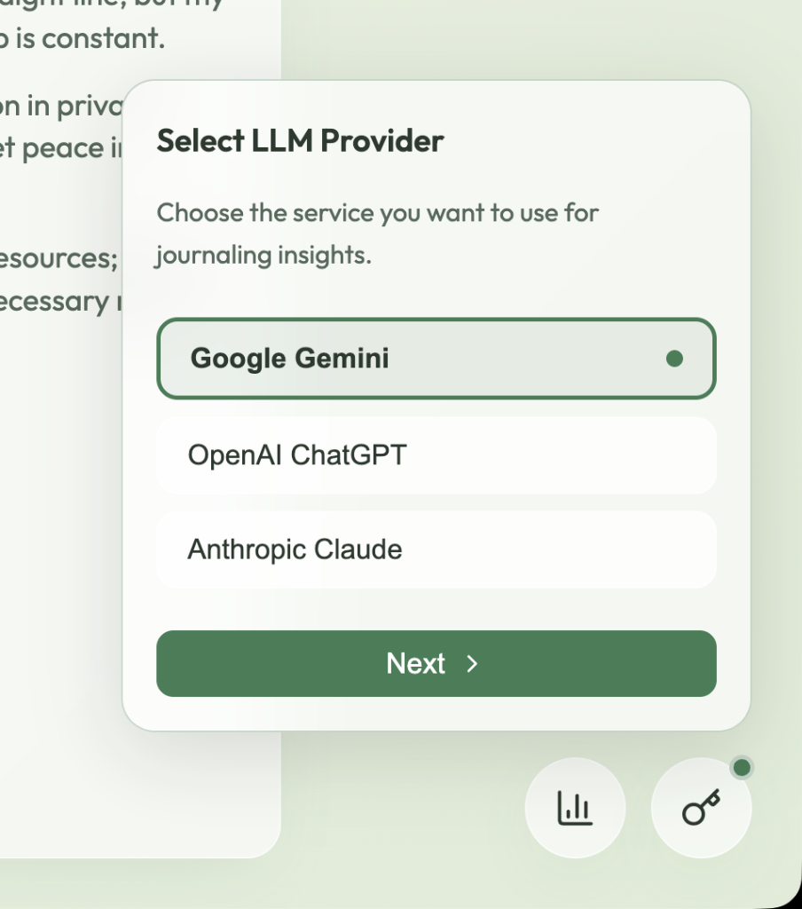
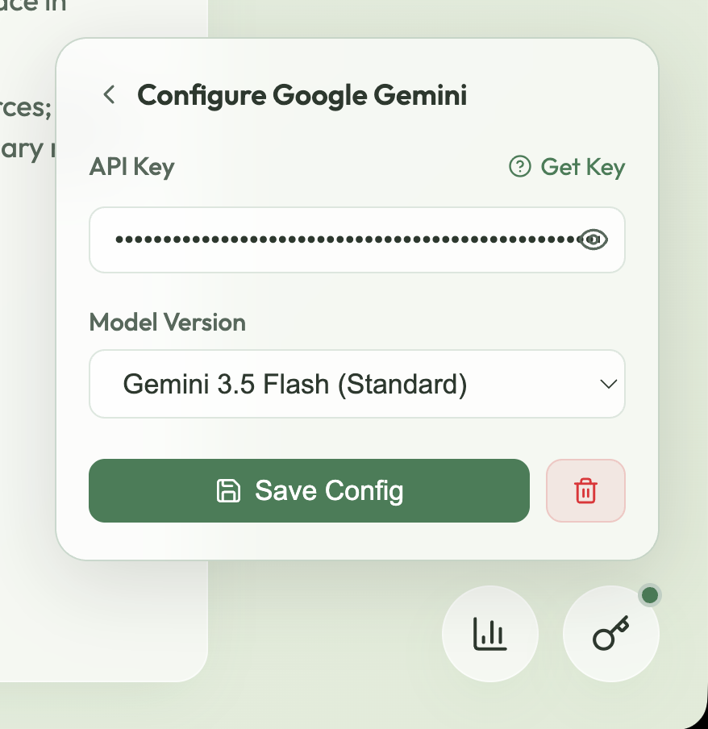

# 🍃 Quiet Space — AI Journal

> **Because doom-scrolling social media until 3 AM and crying over your NIFTY 50 trading options losses is not a therapy plan.** 

Welcome to **Quiet Space**—a private, local-only, offline-first digital sanctuary for your mind. It takes your raw daily thoughts, gym plateaus, fitness setbacks, and minor financial breakdowns, filters them through a local LLM API of your choice, and mirrors them back as structured, first-person insights. 

It is completely client-side, local-first, and serverless. Your private keys and thoughts stay on your device, stored inside your browser's local cache. No databases, no trackers, no cloud leaks.

---

## 📸 Dashboard Overview


*A minimalist, responsive dashboard designed to inspire peace and reflection.*

---

## ✨ Features

- **Personalized First-Person Insights**: AI extracts problems, learnings, strengths, and motivational quotes from your logs written in the first person (using *I*, *my*, *me*) so they read as your own reflections.
- **Bring Your Own Key (BYOK)**: Supports Google Gemini, OpenAI (ChatGPT), and Anthropic (Claude) APIs.
- **Direct Client Connection (Safe & Private)**: All API keys and journal logs are stored locally in your browser's `localStorage` and sent directly to the model endpoints. No backend servers, no tracking, and no database leaks.
- **Usage & Cost Tracking**: Monitor your token consumption (today and all-time) with a built-in estimator reflecting public API pricing.
- **Backup & Control**: Download your memories as a JSON backup file or import existing logs. Wipe all local data anytime with a high-safety confirmation mechanism.
- **Granular Widget Control**: Erase or refresh individual widgets independently to save API tokens and refine specific insights.

---

## 🚀 One-Click Quick Launch (Cross-Platform)

You can set up and start the application instantly with zero manual terminal configuration on any laptop:

###  macOS
Double-click the **`start.command`** file in your Finder.
- *(Note: If Node.js is missing, the script will automatically install it via Homebrew or download/open the official macOS pkg installer for you!)*

### ❖ Windows
Double-click the **`start.bat`** file in your File Explorer.
- *(Note: If Node.js is missing, the script will automatically run PowerShell in the background to download the official Windows `.msi` installer and open it for you!)*

### 🐧 Linux / Bash Shell
Run the shell script in your terminal:
```bash
chmod +x start.sh && ./start.sh
```

*What these scripts automate:*
- Opens the command line window and directs it to the project folder.
- Automatically runs package installation (`npm install`) on first launch.
- Starts the local dev web server.
- Opens **Google Chrome** automatically to the local web page (`http://localhost:5173`).

---

## 🛠️ Manual Terminal Installation

### 1. Clone the repository
```bash
git clone https://github.com/your-username/QuietSpace.git
cd QuietSpace
```

### 2. Install Dependencies
```bash
npm install
```

### 3. Start the Local Server
```bash
npm run dev
```

### 4. Open in Browser
Visit `http://localhost:5173` in your browser.

---

## 🔑 LLM Setup Guide (Wizard)

Setting up your intelligence engine is simple and happens entirely in the floating bottom-right of your page.

| Step 1: Select LLM Provider | Step 2: Configure API Key & Model |
| --- | --- |
|  |  |
| Click the key icon in the bottom-right and select your provider (Gemini, ChatGPT, or Claude). | Enter your personal API key, select a model version, and click **Save Config**. |

### 💡 API Keys Source:
- **Google Gemini**: Get a free or pay-as-you-go key from [Google AI Studio](https://aistudio.google.com/).
- **OpenAI ChatGPT**: Generate a developer key from [OpenAI Developer Console](https://platform.openai.com/).
- **Anthropic Claude**: Create an API key in the [Anthropic Console](https://console.anthropic.com/).

---

## 🔒 Privacy & Security (FAQ)

**Q: Can the creator or other third parties read my journal entries?**
> **No.** The application is 100% local, serverless, and open-source. The code runs entirely on your own laptop as a local web application. There are no backend databases, tracking scripts, or host-side logs. Your private logs never go to any "website provider" or third-party server.

**Q: Where is my API key stored? Is it safe?**
> **Yes.** You input your LLM API key directly into the application window. The key is stored inside your browser's secure `localStorage` sandbox on your local machine. It never leaves your device, is never uploaded online, and is completely invisible to anyone else.

**Q: How does the AI analysis work then?**
> When you write an entry, the application uses your saved API key to make a direct HTTPS request from your browser to the chosen LLM provider's official server (Google, OpenAI, or Anthropic). Your journal data travels securely to the model endpoints for processing, exactly as it does when you use the official ChatGPT, Gemini, or Claude web interfaces.

---

## 💾 Local Storage Schema

All configuration and data is stored locally under:
- `AI_JOURNAL_DATA`: Contains your logs and widget insights.
- `AI_JOURNAL_API_KEY_<provider>`: Stores your respective keys.
- `AI_JOURNAL_USAGE`: Keeps track of token usage records.
